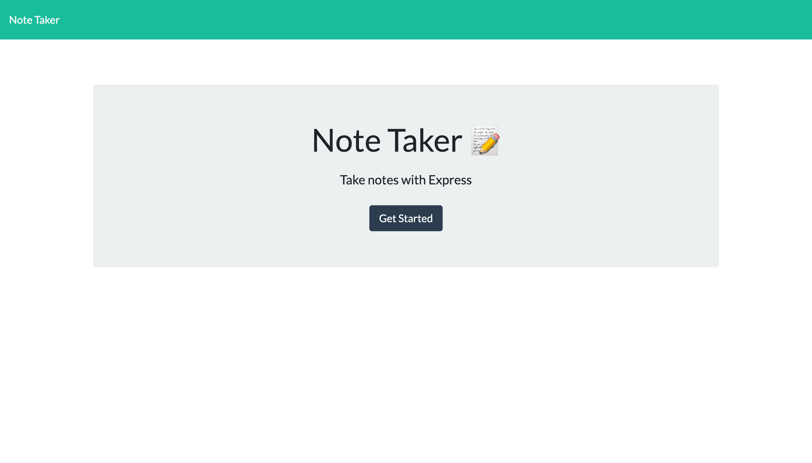

# note-taker

## Description

Note taking application that allows the user to generate and save notes using a live server.

## Table of Contents

* [Installation](#Installation)
* [Usage](#Usage)
* [Tests](#Tests)
* [Questions](#Questions)

## Installation

Required packages:
  * NodeJS
  * ExpressJS

## Usage

To invoke the application run this command in the terminal:

```bash
node server.js
```

If user is creating the server on their local device, the application will host a server listening to PORT 3001. If accessing the application through Heroku, the PORT may be different.

To access the application in the browser through the user's local device, type ```http://localhost:3001/``` to access the ```index.html```.

The user will then be taken to the ```notes.html``` page in which new notes can be created and saved. All new notes will be saved in the ```db.json``` file.

## Tests

### Home Screen



## Questions

Do you have questions? Contact me here:

* [GitHub](https://github.com/laurenlgoss)
* [Email](laurenlgoss98@gmail.com)